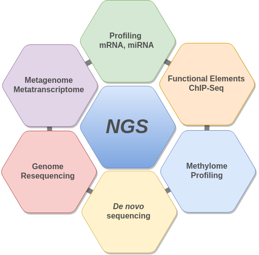
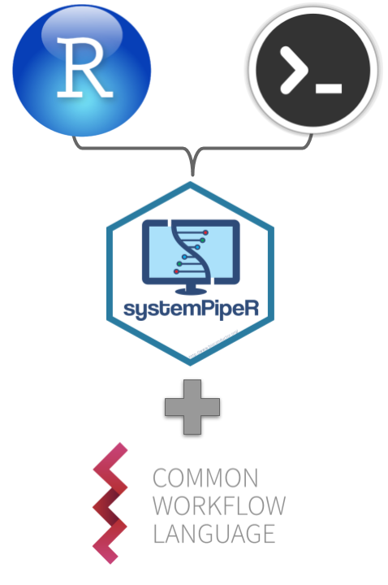
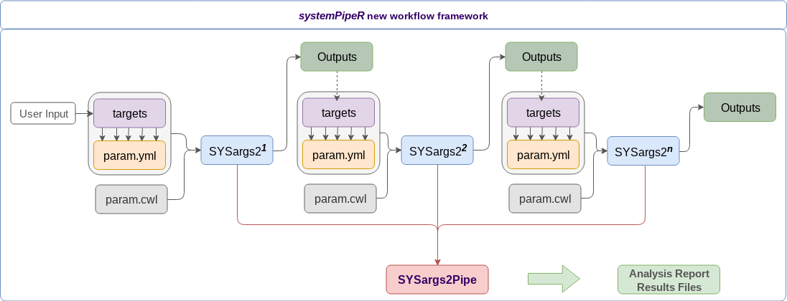
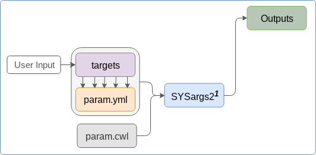
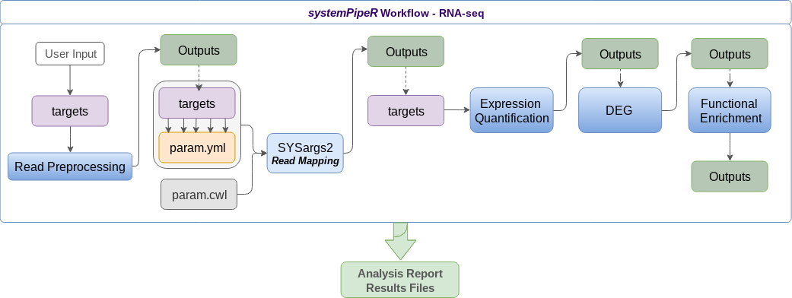
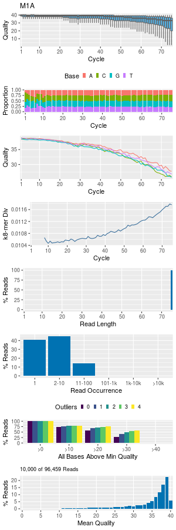
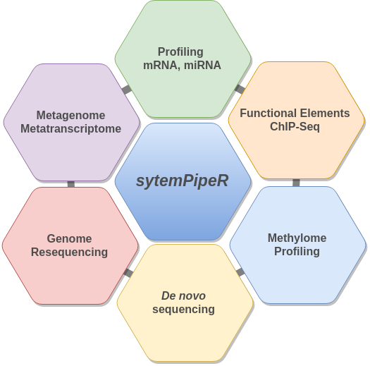
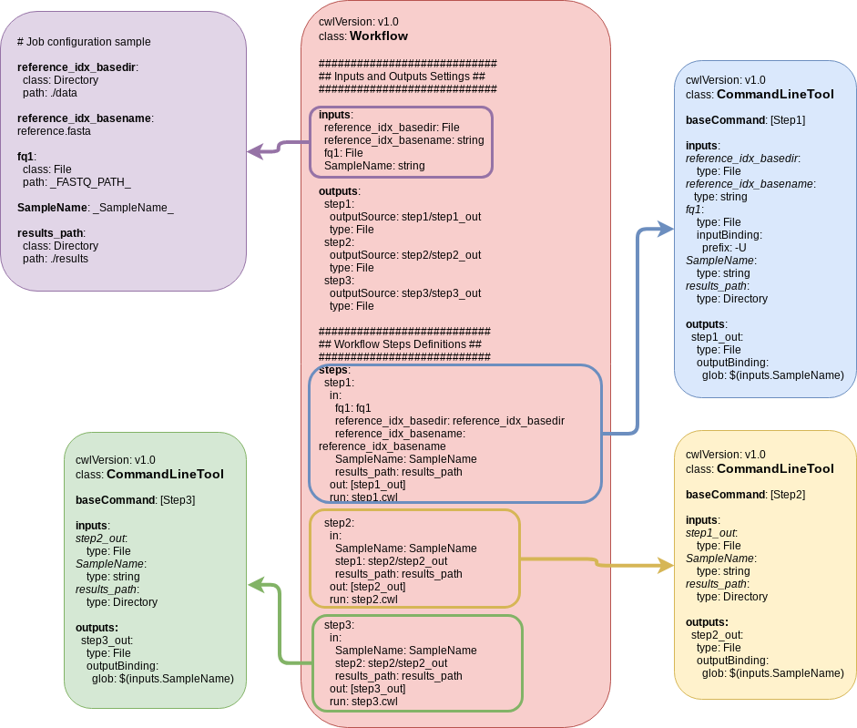

# Outline

## Outline
- Introduction
  - Motivation
  - *systemPipeR*
- Design
- Getting started
- Workflow Demonstration

# Introduction

## Motivation

- Many NGS applications share several analysis routines, such as: 
  - Read QC and preprocessing
  - Alignments
  - Quantification
  - Feature annotations
  - Enrichment analysis 

- Thus, a common workflow environment has many advantages for improving **efficiency, standardization and reproducibility** </br>

<br><center><center>

## Common Workflow Environment: Requirements 

  - Design and execution of end-to-end analysis pipelines
  - Support for R and command-line software
  - Runs on single machines and compute clusters  
  - Uniform interface across different data analysis applications
  - Uniform sample handling and annotation
  - Automated report generation
  - Flexibility to support custom changes and new software/tools

## *systemPipeR* {#Advantages_bk}

  - [*systemPipeR*](http://www.bioconductor.org/packages/devel/bioc/html/systemPipeR.html) is an R package for building *end-to-end* analysis pipelines with automated report generation for data analysis applications <br>
  
<center><center>

[.](#Advantages)

## Adopting CWL

<div id="left">

<top><top>

</div>

<div id="right"><br>

  - CWL is a community standard for describing computational data analysis workflows
     - Provide portability and scalability across platforms and environments
  - Integration of CWL allows running *systemPipeR* workflows from a single specification instance:
      - Entirely from R
      - Command-line wrappers (*cwl-runner* or *cwl-tools*)
      - Other languages 
  - Support resources for containerization, parallel evaluations on computer clusters
  - Can be applying for any tools/software

</div>

## Advantages {#CWL_bk}

  - Using CWL to generated *systemPipeR* param files: command-line and workflow definition [format](#CWL)
  - Flexible debugging process for all the steps
  - Allows complex experimental design: using *targets* files
  - Downstream visualization report: integration of workflow plot and data analysis report
  - Sharing of workflows with related environments (e.g., Galaxy or Snakemake)

# Design

## Workflow design in *systemPipeR* {#targets_bk}



- [*targets*](#targets) file 
- [CWL](#CWL) design 
- [*SYSargs2*](#sysargs2) generation 

## Workflow design in *systemPipeR*

  - *`SYSargs2`* S4 class is a list-like container 
  - Workflow steps operations are controlled by *`SYSargs2`* instances
  - Each *`SYSargs2`* instances are generated by two constructor functions, *`loadWorkflow`* and *`renderWF`*
  - Only input provided by user is initial *`targets`* file. Subsequent *`targets`* instances are created automatically
  - Any number of predefined or custom workflow steps are supported <br>
<br>
  - *`SYSargs2Pipe`* allows loading as many *`SYSargs2`* instances into a single compound object
    - Storage all information required to run, control and monitor workflows from start to finish

# Getting Started

## Install and load packages 

- Install required packages

```{r install, eval=FALSE}
if (!requireNamespace("BiocManager", quietly=TRUE))
    install.packages("BiocManager")
BiocManager::install("systemPipeR")
BiocManager::install("systemPipeRdata", build_vignettes=TRUE, dependencies=TRUE) 
```

- Load packages and accessing help
```{r load_systemPipeR_hidden, eval=TRUE, include=FALSE, messages=FALSE, warnings=FALSE, cache=TRUE}
library("systemPipeR"); library("systemPipeRdata")
```
```{r load_systemPipeR_print, eval=FALSE, messages=FALSE, warnings=FALSE, cache=TRUE}
library("systemPipeR")
library("systemPipeRdata")
```
- Access help
```{r accessing_help, eval=FALSE, messages=FALSE, warnings=FALSE, cache=TRUE}
library(help="systemPipeR")
vignette("systemPipeR")
```

## Load Sample Workflow

### *systemPipeRdata*

- Helper package to generate with a single command NGS workflow templates for *systemPipeR*
- Includes sample data for testing
- User can create new workflows or change and extend existing ones
- Template Workflows:
    - Sample workflows can be loaded with the *`genWorkenvir`* function from **systemPipeRdata**
```{r load_sample, eval=FALSE, messages=FALSE, warnings=FALSE, cache=TRUE}
library(systemPipeRdata)
genWorkenvir(workflow="rnaseq")
setwd("rnaseq")
```

## Structure of Workflow Templates 

  - The workflow templates generated contain the following preconfigured directory structure

<center><center>

  - The above structure can be customized as needed, but users need to change the code/vignette accordingly


## *Targets* file organizes samples {#targets}

- Structure of *`targets`* file for single-end (SE) library
```{r show*targetsSE, eval=TRUE, messages=FALSE, warnings=FALSE, cache=TRUE}
targetspath <- system.file("extdata", "targets.txt", package="systemPipeR")
read.delim(targetspath, comment.char = "#")[1:3,1:4]
```

- Structure of *`targets`* file for paired-end (PE) library
```{r show*targetsPE, eval=TRUE, messages=FALSE, warnings=FALSE, cache=TRUE}
targetspath <- system.file("extdata", "targetsPE.txt", package="systemPipeR")
read.delim(targetspath, comment.char = "#")[1:3,1:5]
```

[Design](#targets_bk)

## *SYSargs2*
<h4>
  - [*SYSargs2*](#targets_bk) instances are constructed from a *`targets`* file and two *`param`* file
    - *`hisat2-mapping-se.cwl`* file contains the settings for running command-line software
    - *`hisat2-mapping-se.yml`* file define all the variables to be input in the specific command-line step </h4>
    
```{r sysargs2*instance, eval=TRUE, messages=FALSE, warnings=FALSE, cache=TRUE}
targets <- system.file("extdata", "targets.txt", package="systemPipeR")
dir_path <- system.file("extdata/cwl/hisat2-se", package="systemPipeR")
align <- loadWorkflow(targets=targets, wf_file="hisat2-mapping-se.cwl",
                   input_file="hisat2-mapping-se.yml", dir_path=dir_path)
align <- renderWF(align, inputvars=c(FileName="_FASTQ_PATH_", SampleName="_SampleName_"))

## Instance of 'SYSargs2':
##    Slot names/accessors: 
##       targets: 18 (M1A...V12B), targetsheader: 4 (lines)
##       modules: 2
##       wf: 0, clt: 1, yamlinput: 7 (components)
##       input: 18, output: 18
##       cmdlist: 18
##    WF Steps:
##       1. hisat2-mapping-se.cwl (rendered: TRUE)
```

<center><center>


## *`SYSargs2`* instance {#sysargs2}

<h4>Slots and accessor functions have the same names</h4>
```{r align_names, eval=FALSE, messages=FALSE, warnings=FALSE, cache=TRUE}
names(align)
#  [1] "targets"       "targetsheader" "modules"       "wf"            "clt"          
#  [6] "yamlinput"     "cmdlist"       "input"         "output"        "cwlfiles"     
# [11] "inputvars" 
```

<h4> *`cmdlist`* return command-line arguments for the specific software, here *`HISAT2`* for the first sample:</h4>
```{r cmdlist, eval=FALSE, messages=TRUE, warnings=FALSE, cache=TRUE}
cmdlist(align)[1]
# $M1A
# $M1A$`hisat2-mapping-se.cwl`
# [1] "hisat2 -S results/M1A.sam  -x ./data/tair10.fasta  -k 1  --min-intronlen 30  --max-intronlen 3000  -U ./data/SRR446027_1.fastq.gz --threads 4"
```

<h4>The output components of *`SYSargs2`* define all the expected output files for each step in the workflow; some of which are the input for the next workflow step</h4>

```{r sysargs2_args_results, eval=FALSE, messages=FALSE, warnings=FALSE, cache=TRUE}
output(align)[1]
# $M1A
# $M1A$`hisat2-mapping-se.cwl`
# [1] "results/M1A.sam"
```

# Workflow Demonstration

##
<center><center>

## Read Preprocessing {#filter_bk}

<div id="left">
<center><center>

</div>

<div id="right"><br>

  - [Read quality filtering and trimming](#filter)
  - [FASTQ quality report](#quality)
  
</div>

## Read mapping with *Hisat2*
 - The NGS reads of this project will be aligned against the reference genome sequence using  Hisat2 [@Kim2015-ve]. 
 
```{r hisat2, eval=FALSE, messages=FALSE, warnings=FALSE, cache=TRUE}
targets <- system.file("extdata", "targets.txt", package="systemPipeR")
dir_path <- system.file("extdata/cwl/hisat2-se", package="systemPipeR")
align <- loadWorkflow(targets=targets, wf_file="hisat2-mapping-se.cwl",
                   input_file="hisat2-mapping-se.yml", dir_path=dir_path)

align <- renderWF(align, inputvars=c(FileName="_FASTQ_PATH_", SampleName="_SampleName_"))
```

 - Subsetting *SYSargs2* instance slots for each workflow step:
```{r hisat2_sub, eval=FALSE, messages=FALSE, warnings=FALSE, cache=TRUE}
subsetWF(align, slot="input", subset='FileName')[1:2]
#>                           M1A                           M1B 
#> "./data/SRR446027_1.fastq.gz" "./data/SRR446028_1.fastq.gz"
subsetWF(align, slot="output", subset=1)[1:2]
#>               M1A               M1B 
#> "results/M1A.sam" "results/M1B.sam"
subsetWF(align, slot="step", subset=1)[1] ## subset all the HISAT2 commandline 
#>                              M1A 
#> "hisat2 -S results/M1A.sam  -x ./data/tair10.fasta  -k 1  --min-intronlen 30  --max-intronlen 3000  -U ./data/SRR446027_1.fastq.gz --threads 4"
subsetWF(align, slot="output", subset=1, delete=TRUE)[1] ##DELETE
#> The subset cannot be deleted: no such file
#>               M1A 
#> "results/M1A.sam"
```

## Run on single machines 

- Run command-line tool, here *`Hisat2`*, on single machine. Command-line tool needs to be installed for this.
```{r run_single, eval=FALSE, messages=FALSE, warnings=FALSE, cache=TRUE}
cmdlist(align)[1:2]
system("hisat2-build ./data/tair10.fasta ./data/tair10.fasta")
runCommandline(align, make_bam = FALSE) 
output(align)
```

- *`runCommandline`*, by default, auto detects SAM file outputs and converts them to sorted and indexed BAM files, using internally *Rsamtools* package [@Rsamtools]
- *`runCommandline`* allows the user to create an exclusive results folder for each step in the workflow and a sub-folder for each sample defined in the targets file

## Parallelization on clusters

- Submit command-line or R processes to a computer cluster with a queueing system (e.g. Slurm) 
- *`clusterRun`* function submits non-R command-line software to queuing systems of clusters using run specifications defined by *`runCommandline`*

```{r run_cluster, eval=FALSE, messages=FALSE, warnings=FALSE, cache=TRUE}
library(batchtools)
resources <- list(walltime=120, ntasks=1, ncpus=4, memory=1024)
reg <- clusterRun(align, FUN = runCommandline, more.args = list(dir=TRUE), 
                  conffile = ".batchtools.conf.R", template = "batchtools.slurm.tmpl", 
                  Njobs=18, runid="01", resourceList=resources)
getStatus(reg=reg)
output(align)
```

## *`SYSargs2Pipe`*

- Check whether all BAM files have been created with the construction of *`SYSargs2Pipe`*

```{r WF_track, eval=FALSE}
WF_track <- run_track(WF_ls = c(align))
names(WF_track)
WF_steps(WF_track)
track(WF_track)
summaryWF(WF_track)

# $`hisat2-mapping-se`
# $`hisat2-mapping-se`$Done
# [1] "Existing expected outputs files: 18"
# 
# $`hisat2-mapping-se`$NotRun
# $`hisat2-mapping-se`$NotRun$Summary
# [1] "Missing expected outputs files: 0"
# 
# $`hisat2-mapping-se`$NotRun$ListFiles
# character(0)

```

- Additional features to be developed here

##
### Alignment Stats 
- The following shows the alignment statistics for a sample file provided by the `systemPipeR` package

```{r align_stats_view, eval=TRUE}
read.table(system.file("extdata", "alignStats.xls", package="systemPipeR"), header=TRUE)[1:4,]
```
 
### Create *`new targets`* files
- To establish the connectivity between different instances, it is possible by 
writing the subsetting output with the *`writeTargetsout`* function to a new 
targets file that serves as input to the next *`loadWorkflow`* and *`renderWF`* call

```{r writeTargetsout, eval=FALSE}
names(clt(align))
writeTargetsout(x=align, file="default", step=1)
```

## Read Quantification {#read_bk}

- Read counting with *summarizeOverlaps* in parallel mode using multiple cores (*BiocParallel*)
- The read counting is preformed for exonic gene regions in a non-strand-specific manner while ignoring overlaps among different genes
- [CODE](#read)
```{r read_counting, eval=TRUE}
read.table(system.file("extdata", "countDFeByg.xls", package="systemPipeR"), header=TRUE)[1:4,]
```

## DEG analysis

- Fully automated for simple pairwise designs
- Supports *edgeR* and *DESeq2*
- The following shows *`DESeq2`* [@Love2014-sh] for any number of pairwise 
sample comparisons specified under the *`cmp`* argument

```{r deseq2_wrapper, eval=TRUE, messages=FALSE, warnings=FALSE, cache=TRUE}
targetspath <- system.file("extdata", "targets.txt", package="systemPipeR")
targets <- read.delim(targetspath, comment="#")
cmp <- readComp(file=targetspath, format="matrix", delim="-")
countDFeBygpath <- system.file("extdata", "countDFeByg.xls", package="systemPipeR")
countDFeByg <- read.delim(countDFeBygpath, row.names=1)
degseqDF <- run_DESeq2(countDF=countDFeByg, targets=targets, cmp=cmp[[1]], independent=FALSE)
degseqDF[1:4,1:6]
```

## DEG analysis

- Filter and plot DEG results for up and down regulated genes. 

```{r deseq2_deg_counts, eval=FALSE}
DEG_list2 <- filterDEGs(degDF=degseqDF, filter=c(Fold=2, FDR=10))
```
<center><center>

## Run Workflows with a Single Command

- All the workflows can run the code from the provided *.Rmd template file from within R interactively 
- Alternatively, it is possible to run the entire workflows or their components from the command-line
    - The following shows how to execute the chosen sample workflow (e.g., systemPipeRNAseq.Rmd) by executing from the command-line:

```{bash run_singleCommand, eval=FALSE}
Rscript -e "rmarkdown::render('systemPipeRNAseq.Rmd')"
```

- During the evaluation of the R code, reports are dynamically autogenerated in PDF or HTML format.

# Acknowledgement

## Acknowledgement

- [Girke Lab](http://girke.bioinformatics.ucr.edu/) - University of California Riverside </br>
</br> 
- Funding Sources
    - NSF [ABI-1661152](https://www.nsf.gov/awardsearch/showAward?AWD_ID=1661152)
    - Bioconductor Travel Award

# Questions

# Additional

## Advantages of *systemPipeR* {#Advantages}

  - Design of complex NGS workflows involving multiple R/Bioconductor packages 
  - Simplifies usage of command-line software from within R
  - Accelerates runtime of workflows via parallelization on computer systems with multiple CPU cores and/or multiple compute nodes
  - Automates generation of analysis reports improving reproducibility
  - Common workflow interface for different NGS applications
  - Makes NGS analysis more accessible to new users

<center><center>

[Return](#Advantages_bk)

## CWL Design {#CWL}
<center><center> [Return](#CWL_bk) / [Design](#targets_bk)

## Read quality filtering and trimming {#filter}

<h4>The function `preprocessReads` allows to apply predefined or custom
read preprocessing functions to all FASTQ files referenced in a
`SYSargs` container, such as quality filtering or adapter trimming
routines. The following example performs adapter trimming with
the `trimLRPatterns` function from the `Biostrings` package.
After the trimming step a new targets file is generated (here
`targets_trim.txt`) containing the paths to the trimmed FASTQ files.
The new targets file can be used for the next workflow step with an updated
`SYSargs` instance, *e.g.* running the NGS alignments using the
trimmed FASTQ files.</h4>

```{r fastq_filter, eval=FALSE}
args <- systemArgs(sysma="param/trim.param", mytargets="targets.txt")
preprocessReads(args=args, Fct="trimLRPatterns(Rpattern='GCCCGGGTAA', subject=fq)",
                batchsize=100000, overwrite=TRUE, compress=TRUE)
writeTargetsout(x=args, file="targets_trim.txt", overwrite=TRUE)
```
[Return](#filter_bk)

## FASTQ quality report {#quality}

<h4>The following `seeFastq` and `seeFastqPlot` functions generate and plot a series of useful 
quality statistics for a set of FASTQ files including per cycle quality box
plots, base proportions, base-level quality trends, relative k-mer
diversity, length and occurrence distribution of reads, number of reads
above quality cutoffs and mean quality distribution. The results are
written to a PDF file named `fastqReport.pdf`.</h4>

```{r fastq_report, eval=FALSE}
args <- systemArgs(sysma="param/hisat2.param", mytargets="targets.txt")
fqlist <- seeFastq(fastq=infile1(args), batchsize=100000, klength=8)
pdf("./results/fastqReport.pdf", height=18, width=4*length(fqlist))
seeFastqPlot(fqlist)
dev.off()
``` 
[Return](#filter_bk)

## Read counting with `summarizeOverlaps` in parallel mode using multiple cores {#read}

<h4> Reads overlapping with annotation ranges of interest are counted for each sample 
using the `summarizeOverlaps` function [@Lawrence2013-kt]. The read counting is
preformed for exonic gene regions in a non-strand-specific manner while ignoring 
overlaps among different genes. The raw read count table (`countDFeByg.xls`) 
is written to a files in the directory of this project. Parallelization is achieved 
with the `BiocParallel` package, here using 8 CPU cores. [Return](#read_bk) </h4> 

```{r read_counting1, eval=FALSE}
library("GenomicFeatures"); library(BiocParallel)
args <- systemArgs(sysma="param/hisat2.param", mytargets="targets.txt")
txdb <- makeTxDbFromGFF(file="data/tair10.gff", format="gff",
                        dataSource="TAIR", organism="Arabidopsis thaliana")
saveDb(txdb, file="./data/tair10.sqlite")
txdb <- loadDb("./data/tair10.sqlite")
(align <- readGAlignments(outpaths(args)[1])) # Demonstrates how to read bam file into R
eByg <- exonsBy(txdb, by=c("gene"))
bfl <- BamFileList(outpaths(args), yieldSize=50000, index=character())
multicoreParam <- MulticoreParam(workers=2); register(multicoreParam)
registered()
counteByg <- bplapply(bfl, function(x) summarizeOverlaps(eByg, x, mode="Union",
                                                         ignore.strand=TRUE, 
                                                         inter.feature=FALSE,
                                                         singleEnd=TRUE)) 
countDFeByg <- sapply(seq(along=counteByg), 
                      function(x) assays(counteByg[[x]])$counts)
rownames(countDFeByg) <- names(rowRanges(counteByg[[1]]))
colnames(countDFeByg) <- names(bfl)
write.table(countDFeByg, "results/countDFeByg.xls", col.names=NA,
            quote=FALSE, sep="\t")
```

<h4>Sample of data slice of count table</h4>

```{r view_counts, eval=FALSE}
read.delim("results/countDFeByg.xls", row.names=1, check.names=FALSE)[1:4,1:5]
```
[Return](#read_bk)

## References 
